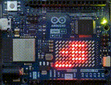

# WiFiDigit
WiFiDigit displays two numbers on Arduino UNO R4 WiFi LED Matrix through HTTP.



```sh
$ curl -X PUT http://192.168.0.1/2digit/-6
$ curl -X PUT http://192.168.0.1/bar/5
$ curl -X PUT http://192.168.0.1/blink-flipped/true/1000.10
```

## Build and run
First, you need to clone this source code:
```sh
$ git clone https://github.com/kumanofoo/WiFiDigit.git
```

The Arduino sketch is located in WiFiDigit/WiFiDigit directory.
After opening WiFiDigit/WiFiDigit/WifiDigit.ino with Arduino IDE,
all files in the directory will be listed in its tab. 

Next, edit *SSID* and *password* in *arduino_secrets.h*:
```C
/* arduino_secrets.h */

#define SECRET_SSID "set_your_ssid"
#define SECRET_PASS "set_your_ssid_password"
```
If you don't want to save *SSID* and *password* in the file, see "Build with Arduino CLI" below.

Finally, build and upload the sketch on Arduino IDE.
WiFiDigit sends WiFi status including IP address to serial monitor,
and displays blinking "❤" on LED matrix until it gets a first command.

### Build with Arduino CLI
Check your board:
```sh
$ arduino-cli board list
Port         Protocol Type              Board Name          FQBN                          Core
/dev/ttyACM0 serial   Serial Port (USB) Arduino UNO R4 WiFi arduino:renesas_uno:unor4wifi arduino:renesas_uno
/dev/ttyS0   serial   Serial Port       Unknown
```

Install the core:
```sh
$ arduino-cli core install arduino:renesas_uno
```

Compile the sketch:
```sh
$ cd WiFiDigit/WiFiDigit
$ arduino-cli compile --fqbn arduino:renesas_uno:unor4wifi
```

Compile the sketch with SSID or password:
```sh
$ cd WiFiDigit/WiFiDigit
$ arduino-cli compile --fqbn arduino:renesas_uno:unor4wifi \
  --build-property "build.extra_flags=-DSECRET_SSID=\"your_ap_ssid\" -DSECRET_PASS=\"your_ap_password\""
```

Upload the sketch:
```sh
$ arduino-cli upload -p /dev/ttyACM0 --fqbn arduino:renesas_uno:unor4wifi
```

Monitor the arduino:
```sh
$ arduino-cli monitor -p /dev/ttyACM0
```

## API
### GET /version

Fetch a version number.

#### Usage examples
```sh
$ curl -X GET http://192.168.0.1/version
1.0.1
```

### PUT /bitmap/{*96_bit_hexadecimal*}
Display bitmap data.

#### Usage examples
```sh
$ curl -X PUT http://192.168.0.1/bitmap/3184a44442081100a0040000
/bitmap/3184a44442081100a0040000
```

#### Parameters
*96_bit_hexadecimal* Bitmap data in 96 bit hexadecimal

```
12x8 LED Matrix

001100011000
010010100100
010001000100
001000001000
000100010000
000010100000
000001000000
000000000000

96 bit binary
001100011000 010010100100 010001000100 001000001000 000100010000 000010100000 000001000000 000000000000
   3   1   8    4   a   4    4   4   4    2   0   8    1   1   0    0   a   0    0   4   0    0   0   0
hexadecimal
```

### PUT /2digit/{*signed_2_digits*}
Display numbers of signed 2 digit.
#### Usage examples
```sh
$ curl -X PUT http://192.168.0.1/2digit/-10
/2digit/-10
```
#### Parameters
*signed_2_digits* signed integer from -99 to 99


### PUT /blink/{*on_duration_ms*}.{*off_duration_ms*}
Blink display.
#### Usage examples
```sh
$ curl -X PUT http://192.168.0.1/blink/1000.10
/blink/1000.10
```
#### Parameters
*on_duration_ms* Duration of turning on LED (milli seconds)

*off_duration_ms* Duration of turning off LED (milli seconds)


### PUT /blink-flipped/{*on_duration_ms*}.{*off_duration_ms*}
Blink display by flipped bits.
#### Usage examples
```sh
$ curl -X PUT http://192.168.0.1/blink-flipped/1000.10
/blink-flipped/1000.10
```
#### Parameters
*on_duration_ms* Duration of turning on LED (milli seconds)

*off_duration_ms* Duration of turning off LED (milli seconds)


### PUT /bar/{*length_dots*}
Display a line on the bottom row.
#### Usage examples
```sh
$ curl -X PUT http://192.168.0.1/bar/5
/bar/5
```
#### Parameters
*length_dots* length of bar (from 0 to 12 dots)


### PUT /bar-flipped/{*length_dots*}
Display a flipped line on the bottom row.
#### Usage examples
```sh
$ curl -X PUT http://192.168.0.1/bar-flipped/5
/bar-flipped/5
```
#### Parameters
*length_dots* length of bar (from 0 to 12 dots)


### PUT /upside-down/{**true**|**false**}
Flip upside down.
#### Usage examples
```sh
$ curl -X PUT http://192.168.0.1/upside-down/true
/upside-down/true
```
#### Parameters
**true** or **false** Display the numbers upside down if true.

